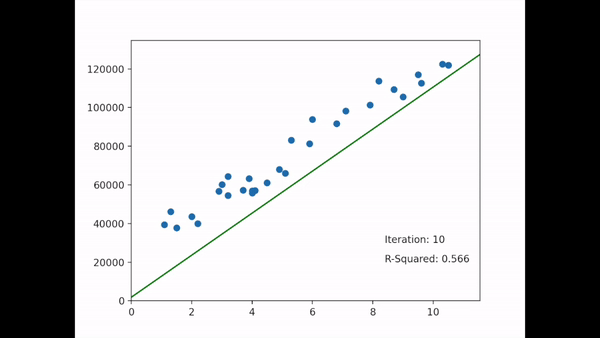

# Linear-Regression-from-Scratch
Developed a python code which fits a simple linear regression model to data using gradient descent and plots each at iteration.

Intercept and gradient linear regression coefficents are randomly initialited and optimsied using gradient descent until at a required tolerence. Progress is plotted at a stated frequency where displays the current model and the r2 value for the model.

## Requirements
* python 3.5.x
* pandas 1.1
* numpy 1.15.0
* matplotlib 3.3.0
* sys
